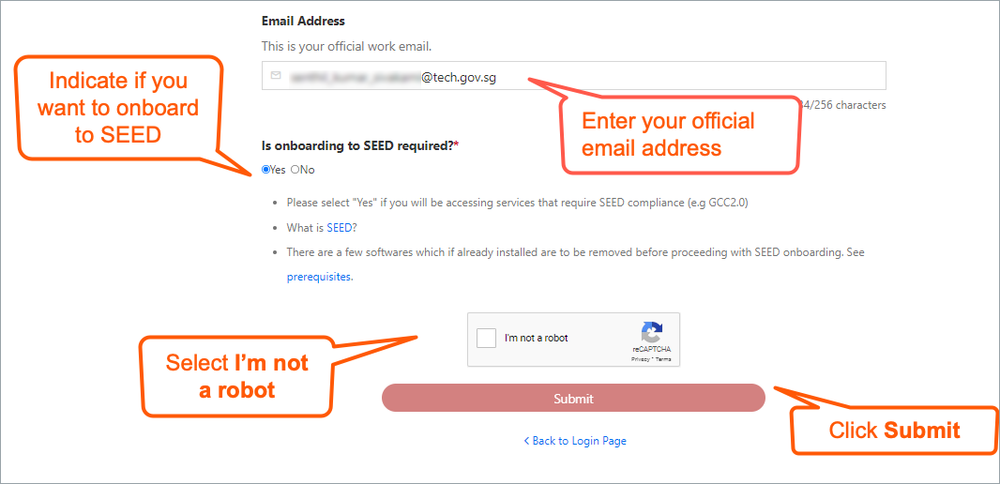
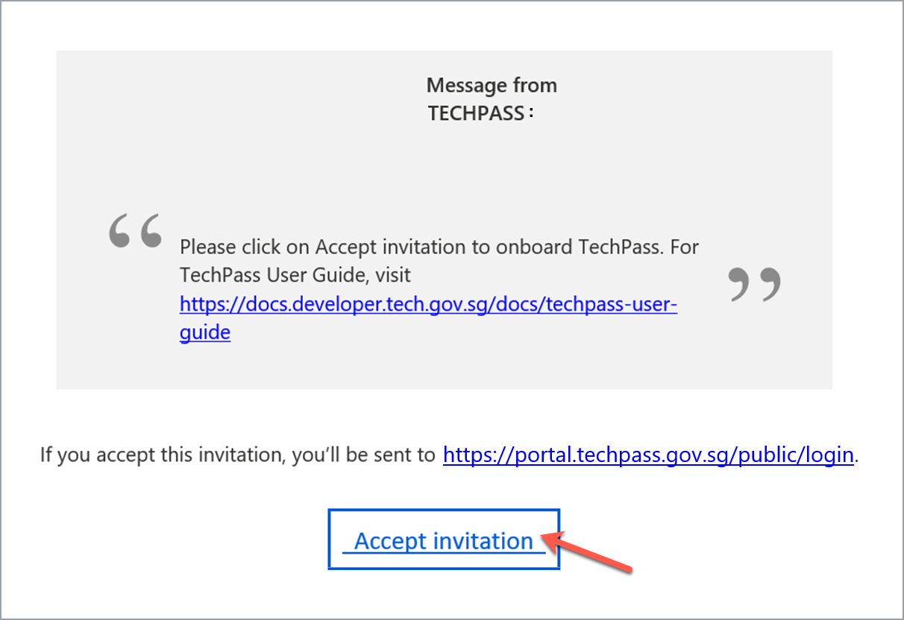
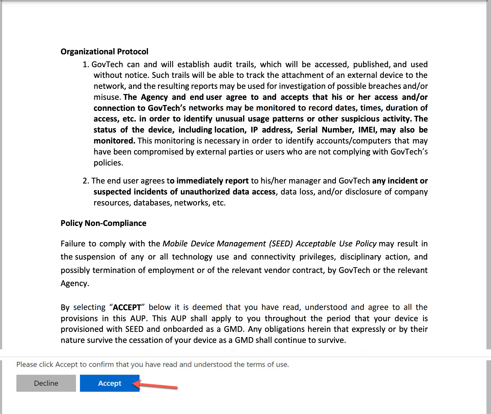

# Onboard to TechPass as public officers

This article guides you to do the following:
- [Sign up for TechPass and SEED](#step-1-sign-up-for-techpass-and-seed).
- [Set up security verification for WOG account](#step-2-set-up-security-verification-for-the-wog-account).
- [Accept TechPass onboarding invitation](#step-3-accept-techpass-invitation).
- [Onboard to TechPass account](#step-4-onboard-to-techpass).

<!--TechPass](https://portal.techpass.gov.sg)
[SEED](https://docs.developer.tech.gov.sg/docs/security-suite-for-engineering-endpoint-devices/#/)-->

You can use the [TechPass portal](http://portal.techpass.gov.sg) to do a self-service sign-up for a TechPass account. Alternatively, contact another public officer to send you the onboarding invitation emails via the [TechBiz Portal](https://portal.techbiz.suite.gov.sg).

> **Tip**: If you are a public officer who is inviting others, refer to [TechBiz documentation](https://docs.developer.tech.gov.sg/docs/techbiz-documentation/).

## Audience

- Public officers using a non-SE GSIB device and whose organisational email address is in the format of *\<your_name\>@\<acronym for your agency\>.gov.sg*.

- Vendors or contractors using a non-SE GSIB device and whose organisational email address is in the format of *\<your_name_from\>.\<vendor organisation name\>@\<acronym for the agency\>.gov.sg*.

> **Note**: If you are a public officer using a SE-GSIB device and intend to request for TechPass or SEED, create a [service request](https://go.gov.sg/techpass-sr) with us. Alternatively, another public officer can invite you to TechPass via the [TechBiz Portal](portal.techbiz.suite.gov.sg).

## Prerequisites

- If you are going to sign up for TechPass account via the TechPass portal, you need a non-SE GSIB device.
- To onboard to TechPass, you must have received the TechPass onboarding email.
- Standard mailbox for the users' organisational email addresses. TechPass does not support email accounts which do not have an inbox, such as LiteMail accounts. If you use such an email account, upgrade it to a standard mailbox before signing up for TechPass.

> **Note**: You will receive the TechPass onboarding email when you sign up for TechPass from the TechPass Portal, or a public officer invites you to TechPass from the [TechBiz Portal](portal.techbiz.suite.gov.sg).

> **Tip**: Click the triangle to view the instructions to complete each step.

## Step 1. Sign up for TechPass and SEED

  
How to sign up for TechPass?

  **To get TechPass invitation email**

  1. From your non-SE GSIB device, go to the [TechPass portal](http://portal.techpass.gov.sg) and click **Sign Up**.

  <kbd></kbd>

  2. Enter your organisational email address.

  > **Tip**: For more information on the acceptable email formats, refer to the [Audience](#audience) section.

  3. Indicate if you want to onboard your non-GSIB or non-DWP device to SEED and select **I'm not a robot**.

  > **Note**:
  >- To access SGTS services using a non-GSIB or non-DWP device, you need SEED.
  >
  >
  >- Apart from the GSIB device, you can access SGTS services via a Government Managed Device(GMD). To achieve this, onboard your non-GSIB or non-DWP device to SEED.

  <kbd></kbd>

  4. Click **Submit**. We will send you the TechPass onboarding invitation email.

  > **Additional information**:
  >- When your request is approved, you'll receive two separate onboarding emails for TechPass and SEED.
  >- If you have requested for SEED provisioning, you will receive the SEED onboarding email around the next three business days.
  >- A TechPass account is created for you and will be *pending* to be activated.
  >- It becomes activated when you [accept the invitation](#step-3-accept-techpass-invitation) and [complete the TechPass onboarding journey](#step-4-onboard-to-techpass).
  >- The TechPass and SEED onboarding invitation emails are valid for 30 days. Refer to SEED documentation for more information on what to do if your SEED onboarding invitation has expired.
  >- If you do not onboard to TechPass within 30 days, we will terminate your TechPass account and notify you via email before the termination. You can again sign up via the TechPass portal or request for TechPass and SEED.
  >- Onboard to TechPass before enrolling your non-GSIB or non-DWP device to SEED.

  

## Step 2. Set up security verification for the WOG account

  
How to set up security verification for WOG account?

  > **Important**: 
  > You need to set up security verification (multi-factor authentication) for your Whole-of-Government(WOG) account to:
    >- Access Singapore Government Technology Stack (SGTS) services and tools from your GMD device.
    >- To view your SG Govt M365 profile on the Microsoft Authenticator app.

    **To set up security verification for WOG account**

  1. From your non-SE GSIB device, go to [Azure Active Directory](https://account.activedirectory.windowsazure.com/proofup.aspx).

> **Note**: To sign in, use your organisational email address and email password.
  2. Select **Mobile app** as the preferred authenticating method, and we strongly recommend you choose **Receive notifications for verification**.

  3. Click **Set up**.
  <kbd></kbd>
  4. Follow the on-screen instructions on the **Configure mobile app** page.
  <kbd></kbd>
  When you scan the QR code on your computer screen, your WOG account gets listed on the authenticator app, and your activation status is confirmed when you click **Next**.
  5. In the **Additional security verification** page, click **Next**.
  <kbd></kbd>
  A notification is sent to your mobile app to verify that you are reachable on your mobile device.
  6. Approve sign-in on the **Authenticator** app.
  7. Click **Done**.
  <kbd></kbd>
  8. Your **Profile** page is displayed.
  <kbd></kbd>
  <!--<kbd></kbd>-->

  

  > **Important**: Complete steps 3 and 4 within the same session.

## Step 3. Accept TechPass invitation

  
Steps to accept invitation

Onboard to TechPass within 30 days of receiving the TechPass invitation email. If you do not onboard within 30 days, we will terminate your TechPass account, and you need to sign up again or request for a TechPass account from a public officer.

  **To accept TechPass invitation**

  1. On your GSIB device, open the TechPass onboarding invitation email.

  > **Note**:
  >- If you do not see this email in your inbox:
  >
  >
  >- check if it is the same email address you provided during the TechPass self-sign-up or in your request for TechPass to a public officer
  >- If a spam filter or email rule moved it to other folders, Junk Email, Deleted Items or Archive folder.

  2. Click **Accept invitation** and proceed with **Onboarding to TechPass**. If you are already signed in to your WOG account, it will direct you to **Review Permissions**.

  <kbd></kbd>

## Step 4. Onboard to TechPass

  
How does a public officer onboard to TechPass?

  **To onboard to your TechPass account**

  1. In **Review Permissions**, click **Accept**.

  <kbd></kbd>

  > **Note**: If you are not signed in to your WOG account while [accepting the invitation](#step-3-accept-techpass-invitation), you will be prompted to sign in before proceeding further.

  2. Click **Log in with TechPass**.

  <kbd></kbd>

  3. Click **Next**.

  <kbd></kbd>

  4. Ensure the organisational email address you used while signing up or requesting for the TechPass account is displayed as username.

  5. Choose one of the following options and click **Next**.

    - If you do not have the Microsoft Authenticator app(recommended) on your mobile phone, download and install it on your [Microsoft phone](https://www.microsoft.com/en-sg/store/apps/windows-phone), [Android](https://play.google.com/store/apps?hl=en&amp;gl=US) or [iOS phone](https://www.apple.com/app-store/) and complete the wizard.
    - To use other authenticators, click **I want to use a different authenticator app**.
    - To use other methods, click **I want to set up a different method**.

    <kbd></kbd>

  > **Note**: While we recommend Microsoft Authenticator, you can choose any other authenticator app. As we recommend Microsoft Authenticator, this article guides you through setting up multi-factor authentication for your TechPass account using that. For other authenticators, refer to the respective help resources.

  6. On your mobile device, open Microsoft **Authenticator** and tap **+ Add account** > **Work or School account**.
  7. Go back to your computer and click **Next**.

  <kbd></kbd>

  8. Scan the QR code on your computer screen and click **Next**. Your TechPass account gets activated and linked to the authenticator app.

  <kbd></kbd>

  The Authenticator sends a notification for you to approve and confirm if the security verification set-up is correct.

  9. Tap **APPROVE** on your mobile device. On your computer, you will see that you have approved your sign-in.

  10. Click **Next**.

  <kbd></kbd>

  11. When you see the success message, click **Done**.

  <kbd></kbd>

  You will now be directed to the Terms of Use page.

  12. Click the arrow to view the **TechPass Terms of Use**.

  <kbd></kbd>

  13. Read the TechPass **Terms of Use** and click **Accept**.

  <kbd></kbd>

  14. Click the arrow to view the **TechPass Privacy Policy**.

  <kbd></kbd>

  15. Read the TechPass **Privacy Policy** and click **Accept**.

  <kbd></kbd>

  16. Click the arrow to view the **TechPass MDM AUP Policy**.

  <kbd></kbd>

  17. Read the policy details and click **Accept**.

  <kbd></kbd>

  You have now successfully onboarded to TechPass. You can now proceed to onboard your non-GSIB or non-DWP device to SEED.

> **Note**: Refer to [Prerequisites for onboarding your device to SEED](https://docs.developer.tech.gov.sg/docs/security-suite-for-engineering-endpoint-devices/#/prerequisites-for-onboarding) before proceeding to onboard your non-GSIB or non-DWP device to SEED.

