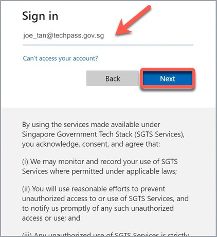
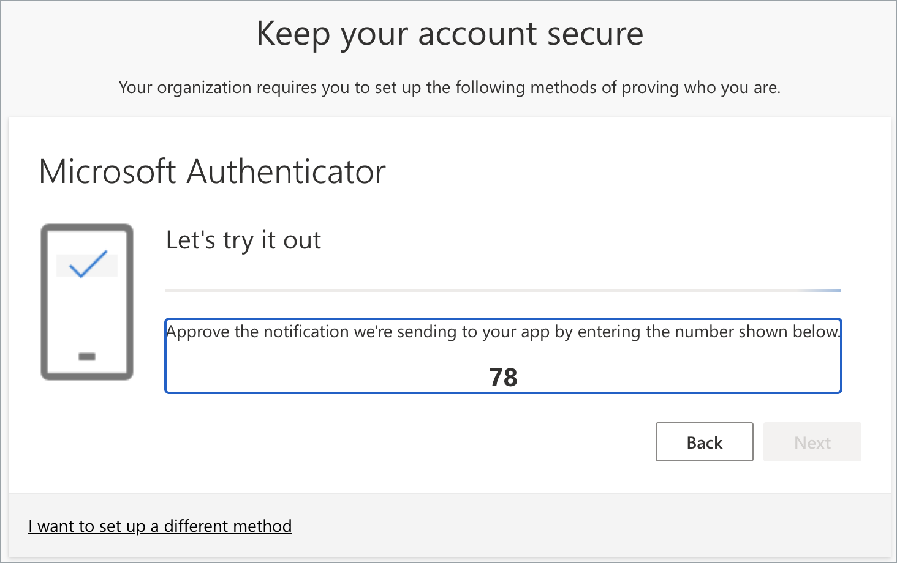
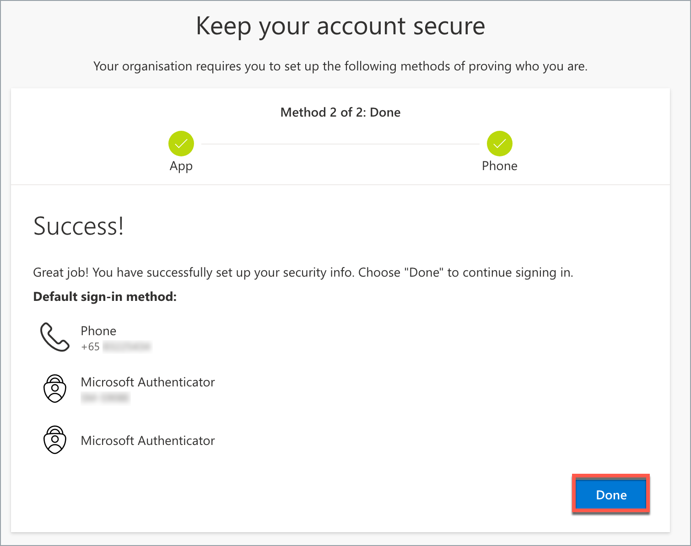

# Get invited and onboard to TechPass

This article guides you how to request for a TechPass account and onboard to it. Refer to the flow chart on [Onboard to TechPass](onboard-to-techpass) page to know if you can sign up for TechPass account via TechPass portal or not. If you can't sign up for TechPass account via TechPass portal, you need to request to get invited.  

?> **Note** - Alternatively, public officers with a non-SE GSIB devices can access [**TechBiz Portal**](https://portal.techbiz.suite.gov.sg) to request for TechPass account. For more information, see [**TechBiz documentation**](https://docs.developer.tech.gov.sg/docs/techbiz-documentation/).

<!--
This article guides vendors to do the following:
- [Request for TechPass account and SEED provisioning](#step-1-request-for-techpass-account-and-seed-provisioning).
- [Sign in to TechPass using initial password](#step-2-sign-in-using-initial-password).
- [Configure and verify MFA for vendor TechPass account](#step-3-configure-and-verify-mfa-for-techpass-account)
- [Reset initial password](#step-4-reset-initial-password).

-->

## Audience

Users who need a TechPass account but do not have a WOG account or a non-SE GSIB device.

## Prerequisites

You need the following to get invited to TechPass and complete the onboarding:

- A standard mailbox for your organisational email address. TechPass does not support email accounts which do not have an inbox, such as LiteMail accounts. If you use such an email account, upgrade it to a standard mailbox before requesting for TechPass.
- Your organisational email address provided by your organisation. 
- Before you onboard, ensure you have received the TechPass onboarding email and is still valid.

?> TechPass onboarding email is valid for 30 days. If you do not onboard to TechPass within this 30 days, we will terminate your TechPass account, and you need to sign up again.

> **Tip**: Click the triangle to view the instructions to complete each step.

## Step 1. Request for TechPass account and SEED provisioning

How to get a TechPass account and request for SEED provisioning?

1. Contact your project manager or the reporting officer to request for TechPass account and SEED provisioning(optional).

!> You need SEED provisioning to access SGTS and GCC 2.0 resources via an Internet Device.

2. Provide the required details in this request such as your organisational email address, mobile phone number and project name.

3. Project manager or the reporting officer contacts the sponsoring agency or the tenant admin to invite you to TechPass.

<!--3. If you are requesting for SEED provisioning, provide the details of your Internet Device.

Your project manager or reporting officer will work with the sponsoring government agency to provide the requested services.
-->

> **Additional information**:
  >
  > **When you are invited to TechPass**
  >- A TechPass account is provisioned for you and is in pending state.
  >- We'll send the TechPass onboarding email to activate the account.
  
  >
  > **If SEED provisioning is approved**:
  >- We'll send the SEED onboarding email within the next three business days.
  >- This email is valid only for 30 days.
  >- Ensure that you have activated your TechPass account before proceeding to onboard your Internet Device to SEED .
  >- If your SEED onboarding email has expired, you need to request again.

 

## Step 2. Sign in using initial password

 
Sign in to TechPass using your TechPass username and initial password

 1. Go to the required Docs portal environment and click **Login**.

    - [Docs portal - staging environment](https://stg.docs.developer.tech.gov.sg/)
    - [Docs portal - production environment](https://docs.developer.tech.gov.sg/)

  2. Enter your TechPass username and click **Next**.

    <kbd></kbd>

  3. Enter the initial password and click **Sign in**.

    <kbd></kbd>

  4. Click **Next** to configure MFA for your TechPass account. 

   <kbd></kbd>

  

## Step 3. Configure and verify MFA for TechPass account

 
 How to configure and verify MFA for a vendor TechPass account?

  1. Install Microsoft Authenticator on your mobile device.
  
  2. Click **Next** on your computer. 

    <kbd></kbd>

  > **Note**
  > You may install any authenticator. However, as we recommend Microsoft authenticator, this document guides you to configure TechPass MFA using that.

  3. On your mobile device, open Microsoft **Authenticator** and select **+ Add account** > **Work or School account**.
  4. Select **Scan a QR code**.
  5. Go back to your computer and click **Next**.

  <kbd></kbd>

  6. Scan the QR code on your computer screen and click **Next**. 
  
  Your TechPass account gets activated and is now linked to the authenticator app.
    <kbd></kbd>     
  
  A number is shown on your browser.

   <kbd></kbd>
  
  7. On the Authenticator app, enter the number shown, and select **Yes** to authenticate your sign-in. 
   
   <kbd></kbd>

  8. On your computer, click **Next**.
  9. Choose the country code, enter your mobile phone number and click **Next**.
  
  <kbd></kbd>

  You will receive a six-digit code on this phone number. 

  10. Enter the six-digit code and click **Next**.

  <kbd></kbd>

  Now your mobile phone is registered successfully to this account.

  11. Click **Next**.

  <kbd></kbd>  

  11. When you see a success message, click **Done**.

  <kbd></kbd>

  Now you will be prompted to reset your initial password.

## Step 4. Reset initial password

 
 How to reset the initial password?

  1. Enter your **initial password**, **new password** and retype the new password to confirm.  

  2. Click **Sign in** to proceed to accept the Terms of Use.

  <kbd></kbd>

## Step 5. Accept Privacy Policy and Terms of Use

 Read and accept the Terms of Use

  1. Read the **Privacy Policy** and click **Accept**.
  2. Read the **Terms of Use** and click **Accept**.
  3. If SEED has been provisioned to you, read the **MDM AUP Policy** and click **Accept**.

  You have now successfully onboarded to your TechPass account. If you need to onboard your Internet Device to SEED, you can proceed now.

?> Refer to [Prerequisites for onboarding your device to SEED](https://docs.developer.tech.gov.sg/docs/security-suite-for-engineering-endpoint-devices/#/prerequisites-for-onboarding) before proceeding to onboard your Internet Device to SEED.

<!--
>- It becomes activated when you [sign in to TechPass using initial password](#step-2-sign-in-using-initial-password),[configure and verify MFA for TechPass account](#step-3-configure-and-verify-mfa-for-techpass-account)and [Reset initial password](#step-4-reset-initial-password).

> **Note**
>- TechPass username is sent to the email address you specified while requesting for TechPass.
>- Initial password is sent to the mobile phone number you specified while requesting for TechPass.

<kbd></kbd>

<kbd></kbd>
<kbd></kbd>

<kbd></kbd>

<kbd></kbd>

<kbd></kbd>

-->