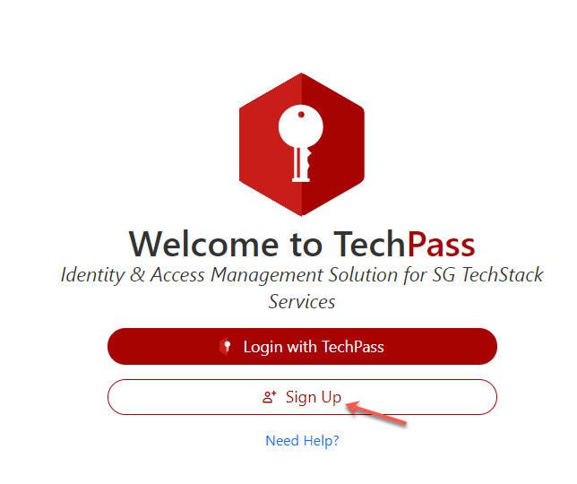
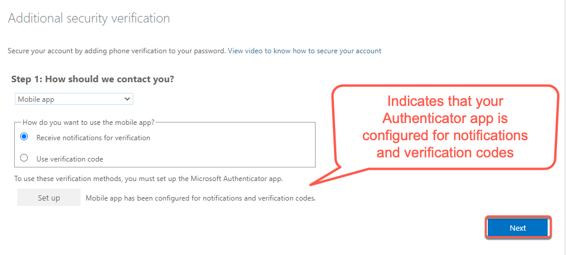
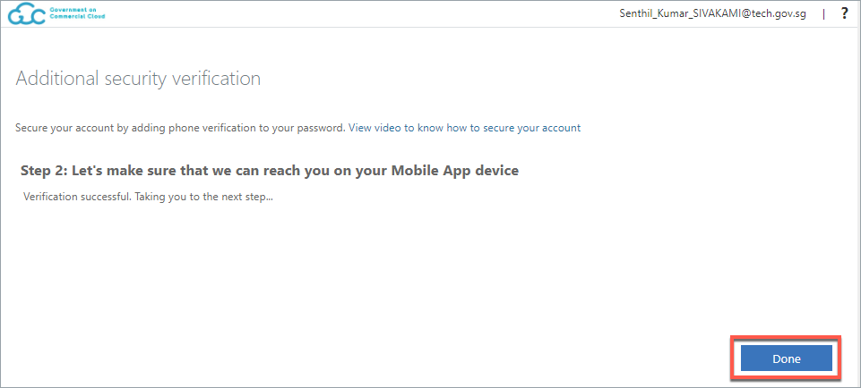
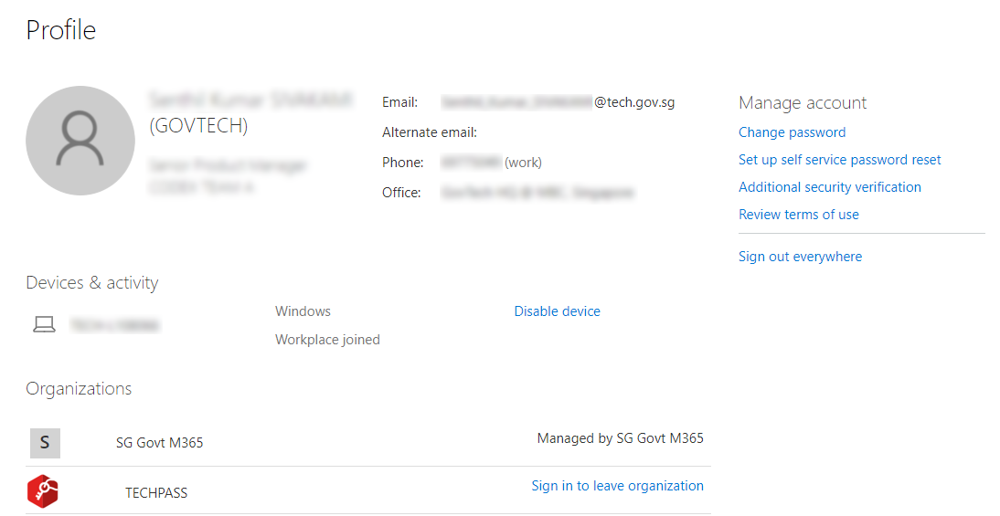
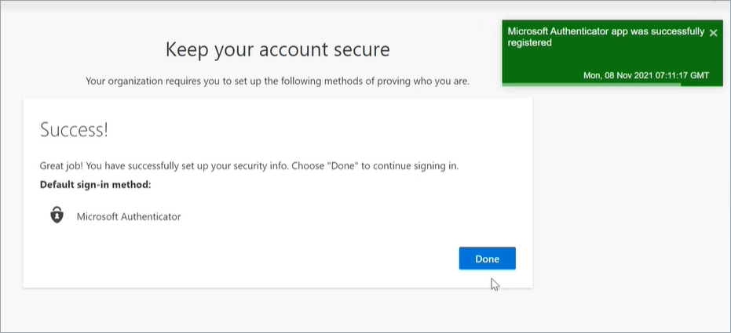
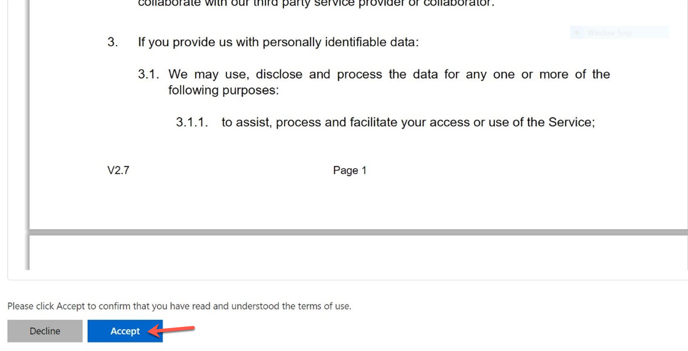

# Step 1: Request for TechPass and SEED provisioning as public officer

This article tells how a public officer with a non-SE GSIB device can request for TechPass and SEED provisioning.

<!--
**Note** 
> If you are a vendor or contractor, you are strongly encouraged to follow the steps mentioned in the Request for TechPass and SEED provisioning as vendor page. This is irrespective of whether you are furnished with a non-SE GSIB device or not.-->

## Audience

- [Public officer using SE-GSIB device](#public-officer-using-se-gsib-device)
- [Public officer using non-SE GSIB device](#public-officer-using-non-se-gsib-device)

> :bulb:
Request for SEED provisioning only if you have an internet device and need to access SGTS resources, products and services from it.

Alternatively, a public officer can request TechPass and SEED provisioning for other public officers and vendors using the [TechBiz Portal](https://portal.techbiz.suite.gov.sg). 

If you are a public officer who is requesting TechPass and SEED provisioning for others, see [TechBiz documentation](https://docs.developer.tech.gov.sg/docs/techbiz-documentation/).

<!--
- Vendors or contractors using a non-SE GSIB device and whose organisational email address is in the format of *\<your_name\>_FROM.\<vendor organisation name\>@\<acronym for the agency\>.gov.sg*. For example, *peter_wilson_FROM.VENDORPROVIDER@tech.gov.sg*.
-->
## Prerequisites

- You need a non-SE GSIB device.
- You need a standard mailbox for the your organisational email address. TechPass does not support email accounts which do not have an inbox, such as LiteMail accounts. If you use such an email account, upgrade it to a standard mailbox before signing up for TechPass.
- Organisational email address must be in the format of *\<your_name\>@\<acronym for your agency\>.gov.sg*. For example, *peter_wilson@tech.gov.sg*.

## Public officer using non-SE GSIB device

If you are a public officer who has a non-SE GSIB device, you can sign up for TechPass and SEED provisioning as needed.

**To sign up for TechPass and SEED provisioning**

  1. From your non-SE GSIB device, go to the [TechPass portal](http://portal.techpass.gov.sg) and click **Sign Up**.

  <kbd></kbd>

  2. Enter your organisational **Email Address**.  

  3. Indicate if you want to onboard your internet device to SEED.

  > :memo: To access SGTS services using an internet device, request for SEED provisioning.
  
  <kbd></kbd>
  4. Select **I'm not a robot** and click **Submit**. 
  

  > **Additional information**:
  >
  > **If TechPass provisioning 
  is approved**:
  >- A TechPass account is provisioned for you and is in pending state.
  >- We'll send the TechPass onboarding email to activate this account.
  >- This email is valid only for 30 days.
  >- If you do not activate your TechPass within 30 days, we will send an email and then terminate your TechPass account. 
  >- You can sign up again via the TechPass portal and request for TechPass and SEED.
  >
  > **If SEED provisioning is approved**:
  >- We'll send the SEED onboarding email within the next three business days.
  >- This email is valid only for 30 days.
  >- Ensure that you have activated your TechPass account.
  >- If your SEED onboarding email has expired, request again for SEED provisioning from your TechPass **Profile** > **Request for SEED**.

<!--
- To onboard to TechPass, you must have received the TechPass onboarding email.
- If you are a SE-GSIB user, use your non-SE GSIB or an internet device to complete steps [2](#step-2-set-up-security-verification-for-the-wog-account) and [3](#step-3-accept-techpass-invitation).

>- If you are a public officer using the SE-GSIB device and want TechPass and SEED provisioning, create a [service request](https://go.gov.sg/techpass-sr).

TechPass account using the [TechPass portal](http://portal.techpass.gov.sg).

Step 1: [Sign up for TechPass and SEED](#step-1-sign-up-for-techpass-and-seed).

Step 2: [Set up security verification for WOG account](#step-2-set-up-security-verification-for-the-wog-account).

Step 3: [Accept TechPass onboarding invitation](#step-3-accept-techpass-invitation).

Step 4: [Onboard to TechPass account](#step-4-onboard-to-techpass).

> **Tip**: Click the triangle to view the instructions to complete each step.

## Step 2. Set up security verification for the WOG account

  
How to set up security verification for WOG account?

  > **Important**: 
  > You need to set up security verification (multi-factor authentication) for your Whole-of-Government(WOG) account to:
    >- Access Singapore Government Technology Stack (SGTS) services and tools from your GMD device.
    >- View your SG Govt M365 profile on the Microsoft Authenticator app.
    >- You must use your non-SE GSIB or an internet device to complete the following steps.

**To set up security verification for WOG account**

  1. From your non-SE GSIB device, go to [Azure Active Directory](https://account.activedirectory.windowsazure.com/proofup.aspx).

> **Note**: To sign in, use your organisational email address and email password.

  2. Select **Mobile app** as the preferred authenticating method, and we strongly recommend you choose **Receive notifications for verification**.

  3. Click **Set up**.
  <kbd></kbd>
  4. Follow the on-screen instructions on the **Configure mobile app** page.
  <kbd></kbd>
  When you scan the QR code on your computer screen, your WOG account gets listed on the authenticator app, and your activation status is confirmed when you click **Next**.
  5. In the **Additional security verification** page, click **Next**.
  <kbd></kbd>
  A notification is sent to your mobile app to verify that you are reachable on your mobile device.
  6. Approve sign-in on the **Authenticator** app.
  7. Click **Done**.
  <kbd></kbd>
  8. Your **Profile** page is displayed.
  <kbd></kbd>
  <kbd></kbd>

  

> **Important**: Complete steps 3 and 4 within the same session.

## Step 3. Accept TechPass invitation

  
Steps to accept invitation

Onboard to TechPass within 30 days of receiving the TechPass invitation email. If you do not onboard within 30 days, we will terminate your TechPass account, and you need to sign up again or request for a TechPass account from a public officer.

  **To accept TechPass invitation**

  1. On your GSIB device, open the TechPass onboarding invitation email.

  > **Note**:
  >- If you do not see this email in your inbox:
  >
  >
  >- check if it is the same email address you provided during the TechPass self-sign-up or in your request for TechPass to a public officer
  >- If a spam filter or email rule moved it to other folders, Junk Email, Deleted Items or Archive folder.

  2. Click **Accept invitation** and proceed with **Onboarding to TechPass**. If you are already signed in to your WOG account, it will direct you to **Review Permissions**.

  <kbd></kbd>

## Step 4. Onboard to TechPass

  
How does a public officer onboard to TechPass?

  **To onboard to your TechPass account**

  1. In **Review Permissions**, click **Accept**.

  <kbd></kbd>

  > **Note**: If you are not signed in to your WOG account while [accepting the invitation](#step-3-accept-techpass-invitation), you will be prompted to sign in before proceeding further.

  2. Click **Log in with TechPass**.

  <kbd></kbd>

  3. Click **Next**.

  <kbd></kbd>

  4. Ensure the organisational email address you used while signing up or requesting for the TechPass account is displayed as username.

  5. Choose one of the following options and click **Next**.

    - If you do not have the Microsoft Authenticator app(recommended) on your mobile phone, download and install it on your [Microsoft phone](https://www.microsoft.com/en-sg/store/apps/windows-phone), [Android](https://play.google.com/store/apps?hl=en&amp;gl=US) or [iOS phone](https://www.apple.com/app-store/) and complete the wizard.
    - To use other authenticators, click **I want to use a different authenticator app**.
    - To use other methods, click **I want to set up a different method**.

    <kbd></kbd>

  > **Note**: While we recommend Microsoft Authenticator, you can choose any other authenticator app. As we recommend Microsoft Authenticator, this article guides you through setting up multi-factor authentication for your TechPass account using that. For other authenticators, refer to the respective help resources.

  6. On your mobile device, open Microsoft **Authenticator** and tap **+ Add account** > **Work or School account**.
  7. Go back to your computer and click **Next**.

  <kbd></kbd>

  8. Scan the QR code on your computer screen and click **Next**. Your TechPass account gets activated and linked to the authenticator app.

  <kbd></kbd>

  The Authenticator sends a notification for you to approve and confirm if the security verification set-up is correct.

  9. Tap **APPROVE** on your mobile device. On your computer, you will see that you have approved your sign-in.

  10. Click **Next**.

  <kbd></kbd>

  11. When you see the success message, click **Done**.

  <kbd></kbd>

  You will now be directed to the Terms of Use page.

  12. Click the arrow to view the **TechPass Terms of Use**.

  <kbd></kbd>

  13. Read the TechPass **Terms of Use** and click **Accept**.

  <kbd></kbd>

  14. Click the arrow to view the **TechPass Privacy Policy**.

  <kbd></kbd>

  15. Read the TechPass **Privacy Policy** and click **Accept**.

  <kbd></kbd>

  16. Click the arrow to view the **TechPass MDM AUP Policy**.

  <kbd></kbd>

  17. Read the policy details and click **Accept**.

  <kbd></kbd>

  You have now successfully onboarded to TechPass. You can now proceed to onboard your internet device to SEED.

> **Note**: Refer to [Prerequisites for onboarding your device to SEED](https://docs.developer.tech.gov.sg/docs/security-suite-for-engineering-endpoint-devices/#/prerequisites-for-onboarding) before proceeding to onboard your internet device to SEED.

-->
