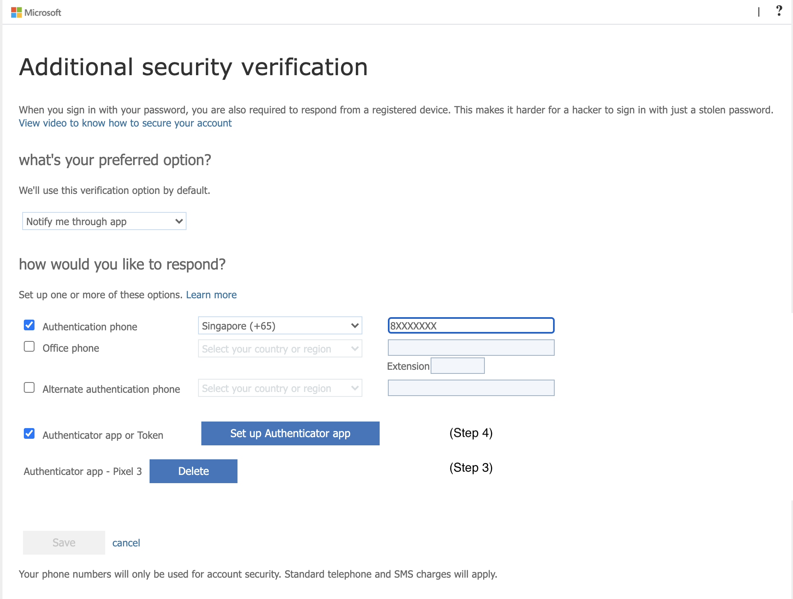
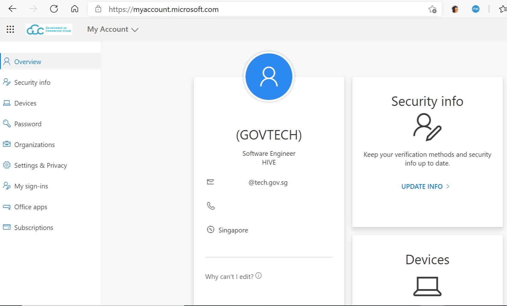
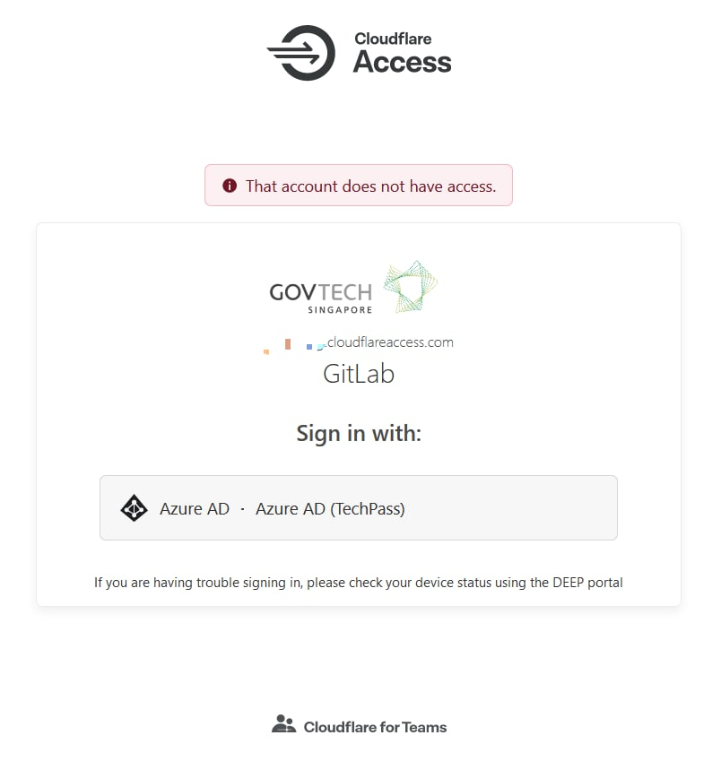
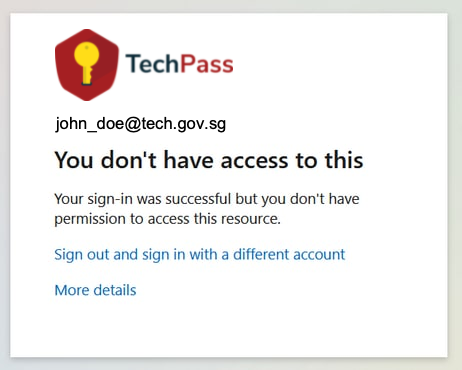

# Support

## Reset password - Vendor
If your account is locked or forget your password, you can follow prompts to unblock yourself and get back to your account. 
Go to https://aka.ms/sspr.

## Reset password - Public Officer
If your account is locked or forget your password, you may attempt accessing https://aka.ms/sspr to reset. Please contact your organisation's AFM tech support if there are problems.

## Reset MFA - new device
If you have a new mobile device, you'll need to set it up to work with multi-factor verification. This is a multi-step solution.

### Step 1
Install the Microsoft Authenticator app on your new mobile device by following the steps in the [Download and install the Microsoft Authenticator app](https://docs.microsoft.com/en-us/azure/active-directory/user-help/user-help-auth-app-download-install) article.

### Step 2
Visit [Microsoft's Additional Security Verification](https://account.activedirectory.windowsazure.com/proofup.aspx?proofup=1) page and sign in.

### Step 3
Delete your current authenticator app

### Step 4
Click **[Set up Authenticator app]** and follow the prompts using the authenticator app you've downloaded on your new mobile device.
You are done if you are a vendor account user.

### Public Officer Only
Step 2 to 4 will help you set up the authenticator app for WOG account. 

Follow these instructions if you got problems with steps 2 to 4.
1. Access [https://myaccount.microsoft.com](https://myaccount.microsoft.com) via your GSIB machine.  
   
2. Access **Security info**, you may be prompted to Approve/enter MFA code for another sign in request  
   
3. You can now add your new phone and delete your old authenticator app  
   

Next, please continue with steps 5 & 6 to set up the authenticator for TechPass Multi Factor Authentication (MFA).

### Step 5
Please send in a service request to revoke your current MFA using this [form](https://go.gov.sg/techpass-sr).

Select **[Request to reset Multi Factor Authentication]** for issue option and fill in the rest of the form. Our support team will send you an email once it's done.

### Step 6
Sign in to TechPass Portal and follow the series of prompt to set up MFA in your authenticator app using your new mobile device

## Reset MFA - lost device

### Public Officer Only
#### Step 1
Please contact your organisation's AFM tech support to help reset your mfa.

#### Step 2
Please send in a service request to revoke your current MFA using this [form](https://go.gov.sg/techpass-sr).

Select **[Request to reset Multi Factor Authentication]** for issue option and fill in the rest of the form. Our support team will send you an email once it's done.

#### Step 3
Sign in to TechPass Portal and follow the series of prompt to set up MFA in your authenticator app using your new mobile device

### Vendor Only
#### Step 1
Please send in a service request to revoke your current MFA using this [form](https://go.gov.sg/techpass-sr).

Select **[Request to reset Multi Factor Authentication]** for issue option and fill in the rest of the form. Our support team will send you an email once it's done.

#### Step 2
Sign in to TechPass Portal and follow the series of prompt to set up MFA in your authenticator app using your new mobile device

## More problems with MFA?
You may visit [Microsoft's Common problems with two-factor verification](https://docs.microsoft.com/en-us/azure/active-directory/user-help/multi-factor-authentication-end-user-troubleshoot) for more information 
or you may send us a service request for your problem using this [form](https://go.gov.sg/techpass-sr).

## Trouble Signing In - Check Device Status in DEEP Portal

(This is only enabled in the PROD environment and only users participating in the MDM End-to-End testing will encounter this issue.)

DEEP is a system that helps developers establish a robust security baseline for their devices, while ensuring only compliant devices can access Government engineering resources.

### Protecting developer devices
DEEP applies a security configuration baseline for each developer device based on industry standards such as the CIS benchmark. It also alerts developers on configuration and malware-related issues via the DEEP Dashboard, providing detailed remediation instructions for each issue.

### Protecting Government engineering resources
DEEP makes use of device-specific configuration and malware information to block developers with at-risk devices from accessing Government engineering resources.

### Login Errors
When a user is blocked by DEEP at the Cloudflare level, the user will be presented this error:

When the user has established a connection with Cloudflare and the user's device has been blocked by DEEP, the user will be get this error:

### Resolution

If you've encountered any of the above errors, try to resolve them by going to the DEEP Portal link listed below based on environment. The DEEP Portal will show you all the issues and instructions on how to fix them.

| Environment | Links                              |
| ----------- | ---------------------------------- |
| PROD        | https://prod.dashboard.dso360.tech |

