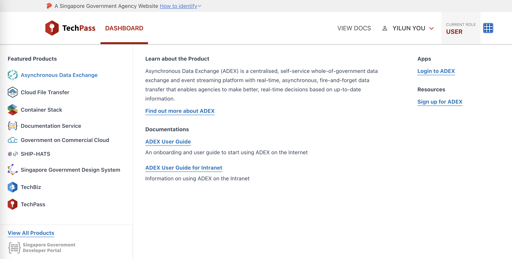
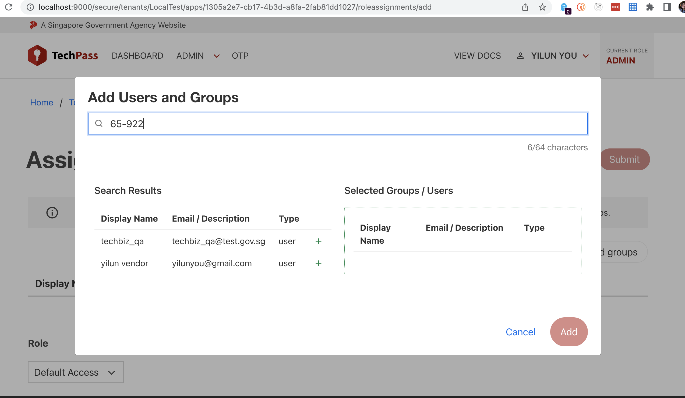

# Staging release notes

## Staging release 20 July 2022
Frontend version: 1.0.0-20220719.0855 | Backend version: 1.24.10-220715.1024
**Improvements** - **Automation API**

Parameter changed in the request for access token

There is a change to the `scope` parameter in the request for access token via client credentials grant.

**Action required**: Change the `scope` parameter value from `https://graph.microsoft.com/.default` to `https://api.techpass.gov.sg/.default`.

For more information, refer to the following:
- [Transition guide](https://docs.developer.tech.gov.sg/docs/techpass-tenant-guide/#/concepts/transition-guide)
- [Change in Automation API Access Token Scope](https://stg.docs.developer.tech.gov.sg/docs/techpass-tenant-guide/#/apis/integration?id=change-in-access-token-scope).

**Fixes** - **Backend**

Fixed the issue that triggered incorrect emails from TechBiz

 A fix has been applied to the email templates to correct the invitation emails triggered from TechBiz.

**Fixes** - **TechPass portal**

UI updated in Managed User page

We have updated the **Email ID** field displayed on the **Managed User** page.

## Staging release 06 July 2022
Frontend version: 1.0.0-20220705.0420 | Backend version: 1.24.6-220701.0601

**New features** - **TechPass portal**

Developer Portal Widget is available on the TechPass portal

A new widget from the Developer Portal has been integrated into the TechPass portal. Using this, you can now access and learn more about the various GovTech featured products.

<kbd></kbd>

  
New webhook in TechPass portal

Tenants can configure a new event webhook, `application-deleted` to get notifications when an application gets deleted from their system.

For more information, refer to [Configuring Webhooks](https://stg.docs.developer.tech.gov.sg/docs/techpass-tenant-guide/#/webhooks?id=configuring-your-webhooks).

  
New webhook in TechPass portal

Tenants can configure a new event webhook, `application-deleted` to get notifications when an application gets deleted from their system.

For more information, refer to [Configuring Webhooks](https://docs.developer.tech.gov.sg/docs/techpass-tenant-guide/#/webhooks?id=configuring-your-webhooks-).

  
New configuration flag for Applications

  A new configuration flag `published` has been added to Applications. When the application is indicated as `published`, it will be visible on the TechPass portal.

 >**Note**:
 >- All existing applications are marked as **published**.
 >- To unpublish an application, clear the **Mark As Published** option.

  

**Improvements** - **TechPass portal**

  

  
Metrics are available only for published applications on TechPass portal

  **Earlier**:
  - Metrics of all the applications were displayed on the TechPass portal login page.

  **Now**:
  - Metrics will be available only for the published applications on the TechPass portal login page.

  

  

  
Search user by mobile number

  The search user feature now allows tenant to search for users by their mobile number.

  

  

**Improvements** - **TechPass portal and Automation API**

  

  
Access token and ID token durations shortened

  Access and ID token durations are shortened for better security posture.

  **Earlier**:
  - Access token was valid for 20 minutes
  - ID token was valid for 60 minutes

  **Now**:
  - Access token is valid for 10 minutes
  - ID token is valid for 10 minutes.

 >**Note**:
 >- You'll be able to request for a new access token, ID token and refresh token if OAuth2.1 refresh_token grant flow is applied.
 >- Refresh token expiration remains the same. The default is 90 days and is a sliding window (extended by issuing a refresh_token grant).

  

  

  
Verify user availability on TechPass before sending TechPass invitation email

  **Earlier**:

  Tenants were unable to find users by mobile number.They were not able to determine if the same user has attempted to request for a new account or if it was a suspicious attempt.

  **Now**:
  Tenants can search for users using their mobile number. This feature comes in handy for tenants to identify if a user already has an account in the TechPass system and if yes, invitation will not be sent to that user.

  For more information, refer to the following documentation:
  - [List Users By Namespace](https://docs.developer.tech.gov.sg/docs/techpass-automation-api/#tag/IAM/paths/~1iam~1namespace~1{namespace}~1users/get)
  - [List Users](https://docs.developer.tech.gov.sg/docs/techpass-automation-api/#tag/IAM/paths/~1iam~1users/get).
  

  

Three different login timestamps available

[Get User Info API](https://docs.developer.tech.gov.sg/docs/techpass-automation-api/#tag/IAM/paths/~1iam~1users~1{identifier}/get) now lists the following three different last login date and time:

  - **lastInteractiveSignInAt**: Displays the timestamp of a user who logs in with the login credentials and MFA.
  - **lastNonInteractiveSignInAt**: Displays the timestamp of a user who logs in without the authenticating factor as the session is still valid.
  - **lastSignInAt**: Composite of the above 2, whichever is later.

  For more information, refer to Microsoft's [Sign In Activities](https://techcommunity.microsoft.com/t5/microsoft-sentinel-blog/non-interactive-logins-minimizing-the-blind-spot/ba-p/2287932) documentation.

  

  

  
Redirect user to TechPass portal login page

  **Earlier**:
  When user clicks the BACK button on their browser while logging out from the TechPass portal, an error is displayed as the session is no longer valid.

  **Now**:
   When user clicks the BACK button on their browser while logging out from the TechPass portal, user will be redirected to the TechPass portal login page.

  

